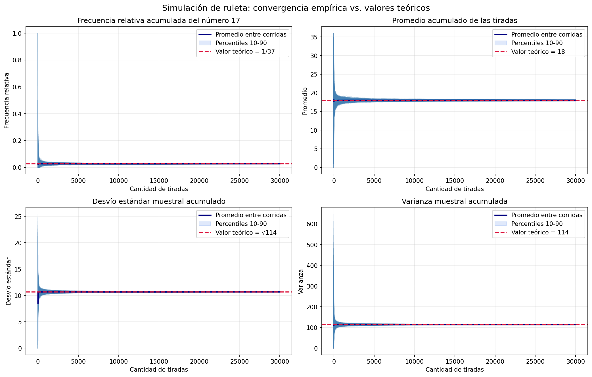

# Análisis de la Simulación de Ruleta (Experimento 1)

En esta sección se detallan los resultados obtenidos tras ejecutar la simulación de la ruleta, basándonos en las consideraciones metodológicas establecidas.

## Parámetros del Experimento

El experimento se configuró con los siguientes parámetros, extraídos de la ejecución de la simulación:
- **Cantidad de tiradas por corrida:** 30.000
- **Cantidad de corridas independientes:** 1.000
- **Número elegido para la frecuencia relativa:** 17
- **Semilla utilizada:** 42 (garantiza la reproducibilidad de los resultados)
- **Archivo de salida generado:** `informe_ruleta1.png`

## Resultados Numéricos Finales y Comparación Teórica

Los valores finales promediados entre las 1.000 corridas, tras completar las 30.000 tiradas cada una, muestran una convergencia excepcional hacia los valores teóricos esperados. 

| Métrica | Valor Empírico (Simulación) | Valor Teórico | Error Absoluto |
| :--- | :--- | :--- | :--- |
| **Frecuencia Relativa (del n° 17)** | 0.0271 | 0.0270 (1/37) | 0.0001 |
| **Promedio** | 17.9994 | 18.0000 | 0.0006 |
| **Varianza** | 114.0122 | 114.0000 | 0.0122 |
| **Desvío Estándar** | 10.6776 | 10.6771 ($\approx \sqrt{114}$) | 0.0005 |

Los errores absolutos demuestran magnitudes ínfimas. Esto confirma que las diferencias detectadas son netamente atribuibles al azar muestral natural, y no a sesgos en el generador de números pseudoaleatorios.

## Análisis Gráfico de la Simulación

A continuación se presentan los gráficos generados por el script, los cuales exponen la evolución temporal (en número de tiradas) de cada métrica.

### Lectura de los Gráficos y Convergencia
En los cuatro paneles (Frecuencia Relativa, Promedio, Desvío Estándar y Varianza) se observa el mismo patrón de comportamiento:

- **Líneas finas:** Ilustran corridas individuales. Al inicio del experimento (pocas tiradas) presentan una dispersión caótica.
- **Línea gruesa:** Representa el promedio entre todas las corridas por tirada.
- **Banda sombreada:** Delimita la dispersión entre corridas (percentiles, habitualmente 10-90).
- **Línea roja punteada:** Indica el valor teórico inamovible de referencia.

**Convergencia:**
El fenómeno más destacable es el achicamiento de la banda sombreada conforme aumenta $n$ (las tiradas). Mientras que en los primeros miles de tiradas las corridas oscilan fuertemente, acercándose a las 30.000 observaciones se agrupan en torno a las medias teóricas. La línea gruesa (el promedio de promedios/varianzas) prácticamente se confunde con la línea roja punteada desde etapas medias de la simulación, evidenciando de forma visual y contundente la **Ley de los Grandes Números**.

## Variabilidad y Discusión Metodológica

El análisis de frecuencia relativa, aunque acotado al número 17, sirve como un estimador representativo del comportamiento equiprobable del sistema, partiendo de la suposición de una ruleta ideal sin imperfecciones. 

A pesar de que con 30.000 tiradas la convergencia global es sólida y la variabilidad se achica (la banda percentil se contrae sustancialmente respecto a los valores iniciales), es interesante notar que las líneas finas revelan que a nivel *individual* siempre habrá corridas puntuales que tarden más en ajustarse o que difieran ligeramente. El aumento del tamaño muestral ha mejorado drásticamente la calidad visual y estadística de este experimento comparado con simulaciones de pocas tiradas.

**Conclusión:**
Los resultados estadísticos observados son compatibles en su totalidad con una ruleta justa. Las métricas son robustas, la dispersión es la esperada para este nivel de repeticiones y la convergencia hacia los valores teóricos queda fuera de toda duda.
