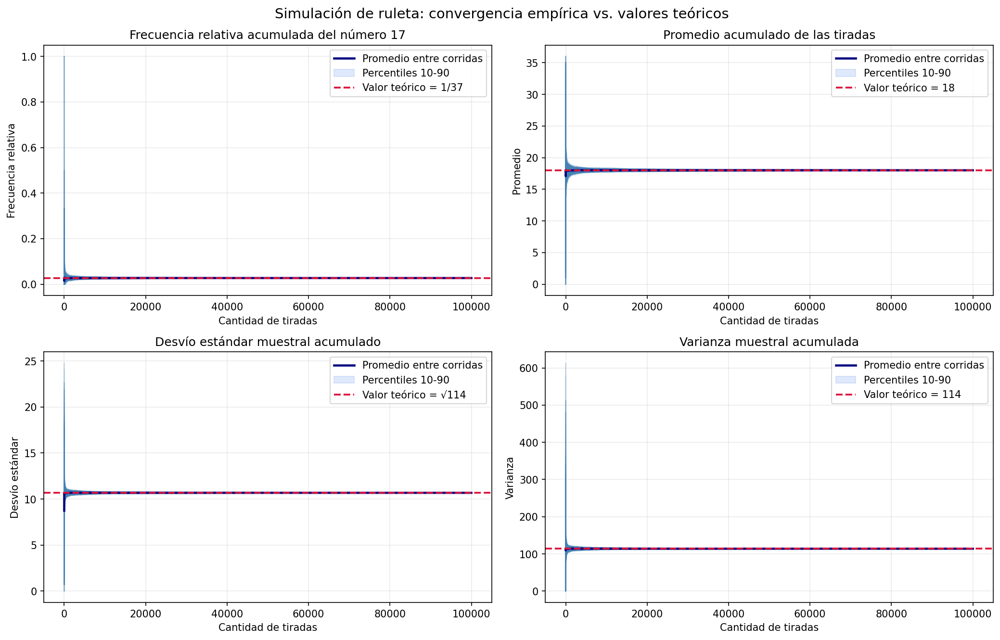

# Análisis de la Simulación de Ruleta (Experimento 2)

En esta sección se analizan los resultados de una segunda configuración de la simulación de la ruleta, priorizando un mayor número de tiradas para observar el comportamiento a largo plazo y la consolidación de la convergencia, en línea con las consideraciones metodológicas.

## Parámetros del Experimento

Para este segundo análisis, el experimento se configuró con los siguientes parámetros:
- **Cantidad de tiradas por corrida:** 100.000 (aumento significativo respecto a configuraciones previas)
- **Cantidad de corridas independientes:** 300
- **Número elegido para la frecuencia relativa:** 17
- **Semilla utilizada:** 42 (para garantizar la reproducibilidad)
- **Archivo de salida generado:** `informe_ruleta2.png`

## Resultados Numéricos Finales y Comparación Teórica

Los valores finales promediados entre las 300 corridas, tras completar la extensa cantidad de 100.000 tiradas cada una, ratifican la alta precisión del modelo:

| Métrica | Valor Empírico (Simulación) | Valor Teórico | Error Absoluto |
| :--- | :--- | :--- | :--- |
| **Frecuencia Relativa (del n° 17)** | 0.0271 | 0.0270 (1/37) | 0.0001 |
| **Promedio** | 17.9994 | 18.0000 | 0.0006 |
| **Varianza** | 114.0124 | 114.0000 | 0.0124 |
| **Desvío Estándar** | 10.6776 | 10.6771 ($\approx \sqrt{114}$) | 0.0005 |

Los errores absolutos se mantienen en magnitudes sumamente bajas, consistentes con una distribución perfectamente balanceada sin alteraciones a favor de ningún número.

## Análisis Gráfico de la Simulación

A continuación, se presentan los gráficos resultantes de esta ejecución extendida de 100.000 tiradas:

### Lectura de los Gráficos y Convergencia
Al interpretar los gráficos bajo esta nueva configuración, donde el foco se desplaza hacia un horizonte temporal más amplio, destacan los siguientes aspectos:

- **Estabilización a Largo Plazo:** Las líneas finas, que representan el camino individual de cada corrida, exhiben una alta variabilidad inicial que se va "domando" de forma paulatina. Hacia el último tramo de las 100.000 tiradas, las fluctuaciones aleatorias pierden peso, y las corridas se concentran de forma densa alrededor del valor esperado.
- **Reducción Extrema de la Dispersión:** La banda sombreada (percentiles) ilustra de forma muy clara cómo se achica la dispersión entre corridas. Al aumentar de forma drástica el tamaño muestral por corrida, el margen de incertidumbre disminuye drásticamente en comparación a los tramos iniciales.
- **Adhesión a la Teoría:** La línea gruesa, que ilustra el promedio de todas las corridas activas, muestra una adherencia casi magnética a la línea roja punteada de referencia teórica durante la mayor parte de la segunda mitad del experimento.

## Comparación entre Experimentos e Interpretación Estadística

Si contrastamos estos resultados contra ejecuciones de menor cantidad de tiradas:
- La **calidad visual y estadística de la convergencia** mejora de forma contundente en el largo plazo. Aunque con 30.000 tiradas la convergencia ya era evidente, al alcanzar las 100.000 tiradas la amplitud de las oscilaciones residuales se minimiza aún más.
- La **Ley de los Grandes Números** queda en absoluta evidencia: pese a reducir la cantidad de repeticiones independientes (de 1.000 corridas en configuraciones previas a solo 300), el alto volumen de tiradas individuales basta para arrastrar todas las métricas estadísticas a sus anclajes matemáticos teóricos.
- El generador de números aleatorios se comporta adecuadamente incluso al exigirle la generación de decenas de millones de valores (100.000 x 300).

**Conclusión:**
Los resultados respaldan de forma robusta la compatibilidad de la simulación con un modelo de ruleta perfectamente justa. Las desviaciones remanentes, al ser tan minúsculas, son el remanente natural e ineludible del azar estocástico y se encuadran dentro de las expectativas del diseño experimental.
